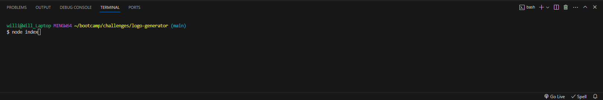
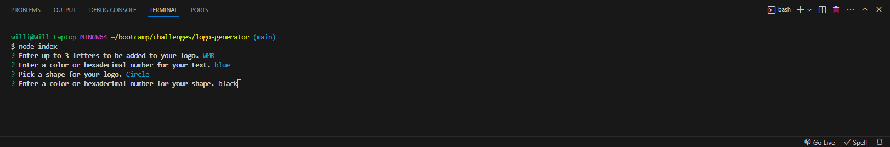

# <Logo Generator>

## Description
As a freelance web developer I want to generate a simple logo for my projects so that I don't have to pay a graphic designer. This project uses node.js and inquirer to produce a simple logo based on user input. 

## Table of Contents (Optional)

If your README is long, add a table of contents to make it easy for users to find what they need.

- [Installation](#installation)
- [Usage](#usage)
- [Credits](#credits)
- [License](#license)

## Installation
Node.js, and inquirer are required to run this application.

## Usage

[Video Example](https://drive.google.com/file/d/1JNkwX6sZJlvV-JsH7U4haLXk9rtpBtyE/view)

Open the terminal for the project folder.

Run 'node index' in the terminal.

Follow the prompts

A logo will be generated as "logo.svg"

## Credits
Tutoring session with Jose Lopez

## License

This repo is covered under the MIT license

## Tests

Run "npm run test" in the terminal to run test for shape classes.